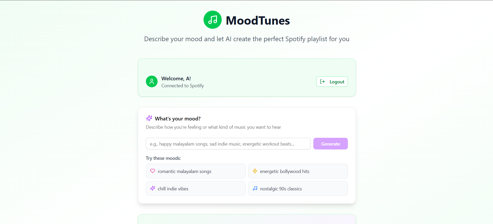

# MoodTunes - Music Recommendation Based on Mood

MoodTunes is a web application that provides personalized music recommendations based on your current mood. It integrates with Spotify to analyze your music preferences and suggest tracks that match your emotional state.

## Features

- Mood-based music recommendations
- Spotify integration for personalized suggestions
- AI-powered mood analysis
- User-friendly interface
- Playlist generation

## Spotify API Access Note

- Due to Spotify's developer account limitations, only **25 users** can access the application through my developer account.
- If you would like to try MoodTunes, please send your name and Spotify account email to **[ashinsabu005@gmail.com](mailto:ashinsabu005@gmail.com)** to be added to the allowed users list.
- You'll be added to the whitelist within 24 hours

## Environment Variables

The following environment variables are required to run the application:
```bash
SPOTIFY_CLIENT_ID=
SPOTIFY_CLIENT_SECRET=
SPOTIFY_REDIRECT_URI=http://127.0.0.1:3000/api/spotify/callback
GEMINI_API_KEY=
NODE_ENV=development
```


## Live Demo

A hosted version of MoodTunes is available at: [mood-tunes-spotify.vercel.app](https://mood-tunes-spotify.vercel.app/)

## Screenshots


**MoodTunes Dashboard** 


**Music Suggestion Interface**


**Playlist In Spotify**


## Technologies Used

- Next.js
- React
- Spotify Web API
- Google Gemini API
- Tailwind CSS


## Contact

For questions or support, please contact:  
Ashinsabu - [ashinsabu005@gmail.com](mailto:ashinsabu005@gmail.com)